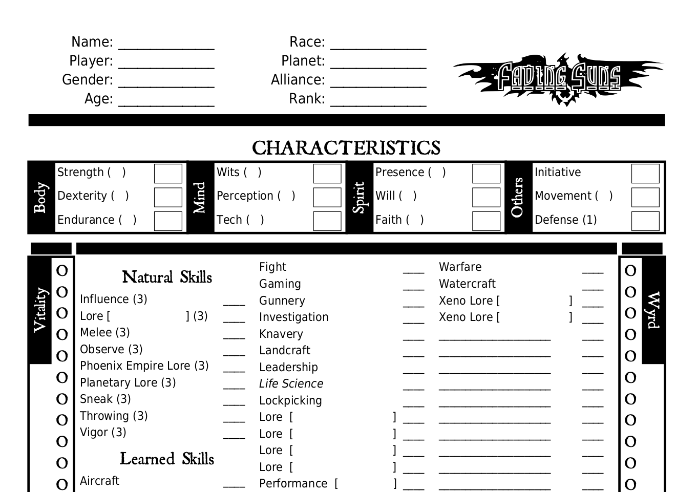

 

# Think Machine

[](https://travis-ci.org/jorgehortelano/ThinkMachine)
[](https://github.com/jorgehortelano/ThinkMachine/blob/master/license/gnugpl/license.txt)
[](https://github.com/jorgehortelano/ThinkMachine/issues)

This software generated in Java allows the creation of a character sheet for the role play game called **Fading Suns** (Revised Edition). Personally, I do not like the provided character sheet in the Player's Guide book, and I have designed a new one, based on some old files I have found ten years ago for previous versions of this game.

To get an idea of the final result, here you have a preview: 

 


If you like the design, and you want to use it, only the final PDF document is needed. To avoid the complexity of compilate this source code and using some programming languages, you can directly download the PDF from these links:
- [Character Sheet (English)](https://github.com/jorgehortelano/TheThinkingMachine/blob/master/sheets/FadingSuns_EN.pdf)
- [Character Sheet (Spanish)](https://github.com/jorgehortelano/TheThinkingMachine/blob/master/sheets/FadingSuns_ES.pdf)

The fonts needed for these PDFs are: [ArchitectsDaughter](https://fonts.google.com/specimen/Architects+Daughter), [DejaVuSans](https://dejavu-fonts.github.io/) and [Roman Antique](http://www.steffmann.de/wordpress/). All of them can be use freely for non-commercial use. You need to download and install them.

If you want to skip the font installation, you can also donwload the sheet in PNG:
- [Character Sheet (English)](https://github.com/jorgehortelano/TheThinkingMachine/blob/master/sheets/FadingSuns_EN-0.png)
- [Character Sheet Reverse (English)](https://github.com/jorgehortelano/TheThinkingMachine/blob/master/sheets/FadingSuns_EN-1.png)
- [Character Sheet (Spanish)](https://github.com/jorgehortelano/TheThinkingMachine/blob/master/sheets/FadingSuns_ES-0.png)
- [Character Sheet Reverse (Spanish)](https://github.com/jorgehortelano/TheThinkingMachine/blob/master/sheets/FadingSuns_ES-1.png)

Click any of these links to get a complete updated copy of the sheet. Still, the code of this application is provided in Github for some reasons:
* Maybe somebody wants to change some texts of the character sheet.
* Maybe somebody wants to translate it to a different language (see below for some instructions).
* In general, I like the idea of free source, and I release this software under the GNU General Public License. 

## Adding a new language
If you are interested in the translation of the sheet in a different language, at the [Wiki](https://github.com/jorgehortelano/TheThinkingMachine/wiki/Adding-a-new-Language) of this project you can find some instructions. 

## Execution
The application has been created using Maven with Java. Therefore, for excuting this application you need both Maven and Java installed on your machine. Then you must execute this command inside the `thinking-machine-core` folder: 

```
mvn exec:java -Dexec.args="en /path/to/file"
```
Where `en` is the language to obtain the file (now can be `en`, `es`) and `/path/to/file` must be a valid path where the application has permissions to generate a file. If this execution is too complex for you, you can always do a pull request on this project and I will generate it for you. 

You can also convert PDF to PNG automatically if you have ImageMagick installed and is at the path. Execute this Maven command:

```
mvn install -Prelease
```
And all the possible PDFs will be generated and later converted to PNG. Final result is located in the sheet folder. 

## Random character generation
From version 0.4.0 exists the option to generate randomly characters sheets. This feature is very usfeul for the creation of random NPC (non-player characters). You can define some basic options for the character such us nobility, psi, combat and more;  and the software will generate the complete character for you in a few seconds. Each character generated is following the rules of the Fading Suns core rule book and therefore, also can be use a playable character. I hope this feature will add extra color in your campaigns.

Some examples already generated are:
- [Catherine Hawkwood (English)](https://github.com/jorgehortelano/TheThinkingMachine/blob/master/NPC/Catherine%20Hawkwood.png)
- [Shinsuke Li Halan (Spanish)](https://github.com/jorgehortelano/TheThinkingMachine/blob/master/NPC/Shinsuke%20Li%20Halan.png)

Still we need to wait until next releases until we have a valid UI to helping the Character creation. 

## Notes
This software has been developed using the [iText library](http://itextpdf.com/) for PDF generation. 

Fading Suns is a TradeMark owned by Holistic Design. 

Fonts used in this project: DejaVuSans, ArchitectsDaughter and Roman Antique. 

[ImageMagick](https://www.imagemagick.org/script/index.php) is a free image manipulation software.


## Versions

0.1.0 Basic PDF generation

0.2.0 Multilingual added (English and Spanish).

0.3.0 Small PDF chart generation added.

0.4.0 Random character generator.

*0.5.0 Lifepath system.*

*0.6.0 Graphical User Interface.*
